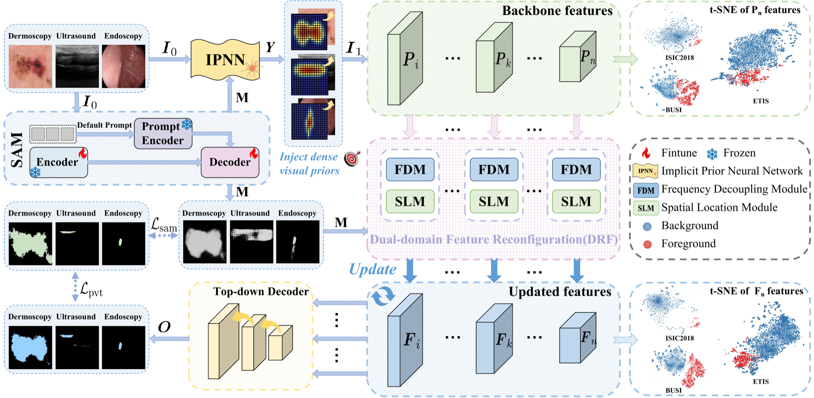
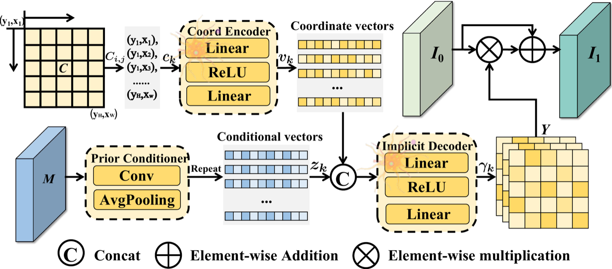
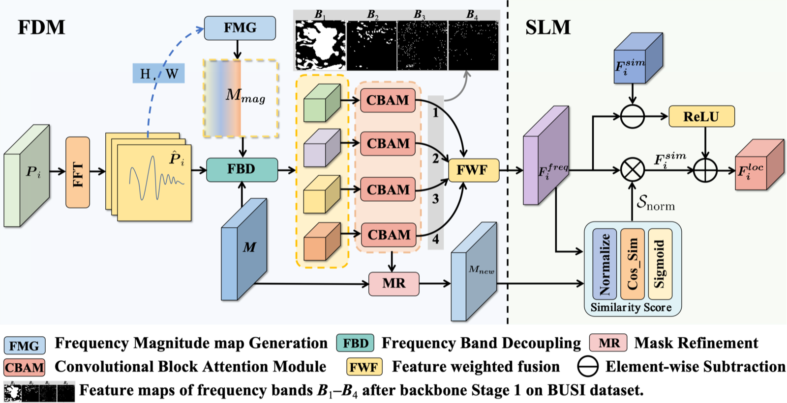
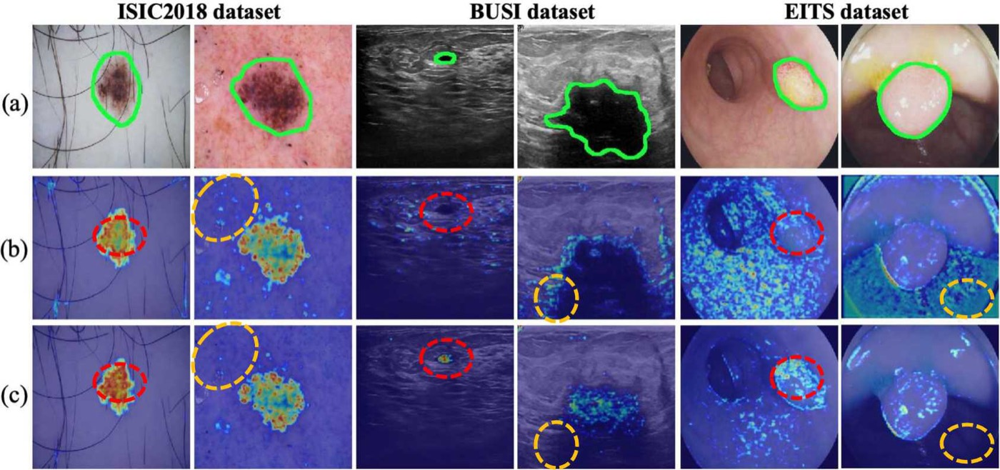
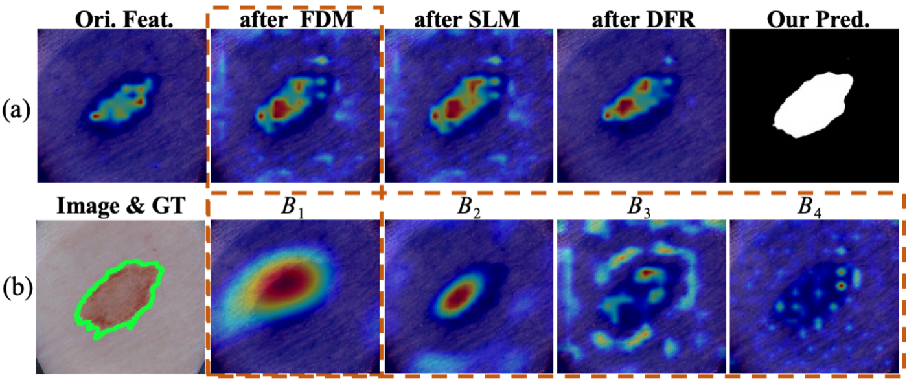

# Feature Reconfiguration With Visual Prior for Medical Lesion Segmentation

[](https://arxiv.org/abs/2609.03535)


Official PyTorch implementation of **Feature Reconfiguration With Visual Prior for Medical Lesion Segmentation**.

## Overview

FreNet performs feature reconfiguration at two complementary levels:

- **Pixel-level reconfiguration:** the Implicit Prior Neural Network (IPNN) injects dense visual priors before encoding to suppress complex background responses.
- **Feature-level reconfiguration:** the Dual-domain Feature Reconfiguration (DFR) module combines frequency decoupling and spatial localization during encoding to improve lesion-background discrimination across diverse lesion morphologies.



## Architecture

### Implicit Prior Neural Network

IPNN models a continuous spatial field conditioned on SAM-derived masks and generates reconfiguration weights for the input image.



### Dual-domain Feature Reconfiguration

DFR contains a Frequency Decoupling Module (FDM) and a Spatial Localization Module (SLM), progressively updating backbone features in the frequency and spatial domains.



## Experimental Results

FreNet was evaluated on nine benchmarks spanning dermoscopy, ultrasound, and endoscopy. The full model with SAM-based visual priors obtains the following results:

| Modality | Dataset | Dice (%) | mIoU (%) |
|:--|:--|--:|--:|
| Dermoscopy | ISIC2018 | **91.0** | **84.5** |
| Dermoscopy | PH2 | **92.7** | **87.1** |
| Ultrasound | BUSI | **82.5** | **74.0** |
| Ultrasound | STU | **89.0** | **80.7** |
| Endoscopy | ETIS | **82.0** | **74.1** |
| Endoscopy | CVC-ColonDB | **79.9** | **72.1** |
| Endoscopy | Kvasir | **91.7** | **86.6** |
| Endoscopy | CVC-ClinicDB | **88.8** | **83.7** |
| Endoscopy | CVC-300 | **86.7** | **79.3** |

On the challenging ETIS dataset, FreNet improves over the SAM baseline by **7.2 Dice points** and **5.7 mIoU points**.

### Ablation Study

The complete model consistently improves over the PVT-based baseline on representative datasets:

| Configuration | ISIC2018 Dice / mIoU | BUSI Dice / mIoU | ETIS Dice / mIoU |
|:--|--:|--:|--:|
| Baseline | 88.4 / 81.0 | 81.1 / 71.6 | 75.0 / 66.2 |
| SAM + IPNN + DFR | **91.0 / 84.5** | **82.5 / 74.0** | **82.0 / 74.1** |

## Visualizations

### IPNN

Grad-CAM visualizations show that IPNN strengthens responses in lesion regions while reducing background activation.



### DFR

The progressive feature responses illustrate how frequency decoupling and spatial localization refine lesion representations.



## Training and Evaluation

```bash
# Training
python train.py --train_data_type=ISIC2018 --test_data_type=ISIC2018

# Evaluation
python test.py --train_data_type=ISIC2018 --test_data_type=ISIC2018
```

Model weights will be released after the paper is accepted.

## Citation

```bibtex
@misc{liu2026frenet,
  title={Feature Reconfiguration With Visual Prior for Medical Lesion Segmentation},
  author={Liu, Yinan and Hong, Jiankang and Gao, Zhen and Luo, Ye},
  year={2026},
  eprint={2609.03535},
  archivePrefix={arXiv},
  primaryClass={cs.AI}
}
```
